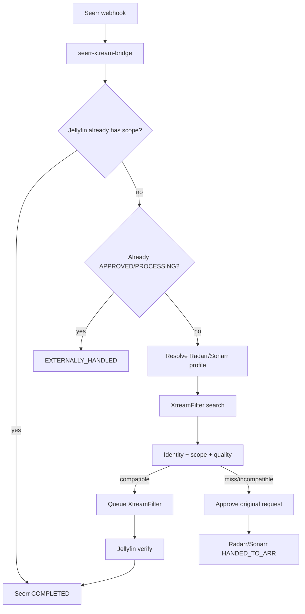

# seerr-xtream-bridge

Production-oriented bridge that lets **XtreamFilter** act as an acquisition backend for **Seerr**, with **Radarr/Sonarr quality-profile awareness** and **Jellyfin** as the source of truth for availability.



## Architecture

- Fastify HTTP API + async reconcile worker
- SQLite (WAL) persisted state machine
- Typed clients: Seerr, XtreamFilter, Jellyfin, Radarr, Sonarr
- Quality evaluation uses **observable** constraints only (resolution/HDR/codec tokens). It does **not** claim to be Radarr’s full release picker.
- Recyclarr may sync profiles into Radarr/Sonarr, but is **not** a runtime dependency.

## Prerequisites

- Seerr, Jellyfin, XtreamFilter, Radarr, Sonarr on a shared Docker network
- Seerr users **without** auto-approve (requests stay `PENDING`)
- Jellyfin libraries that include XtreamFilter download paths
- Bridge **not** behind Gluetun (XtreamFilter may be)

## Important limitation: provider connections

XtreamFilter downloads sequentially, but it does **not** coordinate with **Dispatcharr**.

With a one-stream IPTV account, a live Dispatcharr stream + XtreamFilter download can exceed `max_connections`.

v1 exposes:

```ts
interface ProviderActivityService {
  canAcquire(source: XtreamSource): Promise<boolean>;
}
```

Default implementation always returns `true`. A future Dispatcharr-aware implementation can plug in without redesigning acquisition.

## Seerr webhook configuration

1. Seerr → Settings → Notifications → Webhook
2. Enable agent
3. Webhook URL: `http://seerr-xtream-bridge:5056/webhooks/seerr`
4. Auth header / custom header: set to the same value as `SEERR_WEBHOOK_SECRET`  
   (Seerr has **no** HMAC webhook secret — shared bearer/header only)
5. Enable notification type **Pending** (`MEDIA_PENDING`)
6. Ensure requesters do **not** have auto-approve permissions

Webhook handler validates, persists/dedupes, enqueues work, returns **202** immediately.

## Environment variables

See [`.env.example`](./.env.example). Required at minimum:

| Variable                            | Purpose                                   |
| ----------------------------------- | ----------------------------------------- |
| `SEERR_URL` / `SEERR_API_KEY`       | Seerr API (needs manage-requests)         |
| `SEERR_WEBHOOK_SECRET`              | Shared webhook auth                       |
| `XTREAMFILTER_URL`                  | XtreamFilter base URL                     |
| `JELLYFIN_URL` / `JELLYFIN_API_KEY` | Verify + refresh                          |
| `BRIDGE_API_KEY`                    | Protect `/api/*`                          |
| `DATABASE_PATH`                     | SQLite path (`/data/bridge.db` in Docker) |

Quality:

| Variable                                 | Default | Meaning                                             |
| ---------------------------------------- | ------- | --------------------------------------------------- |
| `QUALITY_UNKNOWN_POLICY`                 | `allow` | `strict` falls back when important metadata unknown |
| `QUALITY_PROFILE_CACHE_TTL_SECONDS`      | `300`   | In-memory profile cache                             |
| `SEERR_AVAILABILITY_GRACE_SECONDS`       | `60`    | Wait for Seerr natural Jellyfin sync                |
| `SEERR_REQUEST_COMPLETION_GRACE_SECONDS` | `60`    | Wait before reconciliation approve                  |

Optional `RADARR_URL`/`RADARR_API_KEY` and `SONARR_*` override Seerr settings-based *arr discovery.

## Docker

```bash
docker compose -f docker-compose.example.yml up -d --build
```

Example service (join your existing `media` network):

```yaml
services:
  seerr-xtream-bridge:
    build: .
    environment:
      - TZ=Europe/Rome
      - SEERR_URL=http://seerr:5055
      - SEERR_API_KEY=...
      - SEERR_WEBHOOK_SECRET=...
      - XTREAMFILTER_URL=http://gluetun:5000
      - JELLYFIN_URL=http://jellyfin:8096
      - JELLYFIN_API_KEY=...
      - BRIDGE_API_KEY=...
      - DATABASE_PATH=/data/bridge.db
    volumes:
      - seerr-xtream-bridge-data:/data
    restart: unless-stopped
```

## HTTP API

| Method | Path                        | Auth                        |
| ------ | --------------------------- | --------------------------- |
| GET    | `/health`                   | public                      |
| GET    | `/ready`                    | public                      |
| POST   | `/webhooks/seerr`           | webhook secret              |
| GET    | `/api/jobs` `/api/jobs/:id` | `X-Api-Key: BRIDGE_API_KEY` |
| POST   | `/api/jobs/:id/retry`       | bridge key                  |
| POST   | `/api/reconcile`            | bridge key                  |
| GET    | `/metrics`                  | optional                    |

## State machine (summary)

Xtream success: `… → XTREAM_DOWNLOADING → WAITING_FOR_JELLYFIN → AVAILABLE → COMPLETING_SEERR → COMPLETED`  
Fallback: `FALLBACK_APPROVING → HANDED_TO_ARR`  
Races: `EXTERNALLY_HANDLED`

Jellyfin must confirm media before Seerr is marked available. Approve on the Xtream-success path is **reconciliation-only**.

## Quality profiles

```
Recyclarr (optional config sync)
        ↓
Radarr / Sonarr  ← runtime source of truth
        ↓
Seerr request (serverId/profileId)
        ↓
Bridge candidate selection
```

Fallback **never** rewrites the Seerr/Radarr/Sonarr profile — it approves the original request.

## Development

```bash
npm install
npm run typecheck
npm run lint
npm run test
npm run dev
```

## Backup

Stop the container or ensure quiescence, then copy:

- `/data/bridge.db`
- `/data/bridge.db-wal` / `/data/bridge.db-shm` if present

## Docs

- [docs/upstream-api-analysis.md](./docs/upstream-api-analysis.md)
- [docs/implementation-plan.md](./docs/implementation-plan.md)
