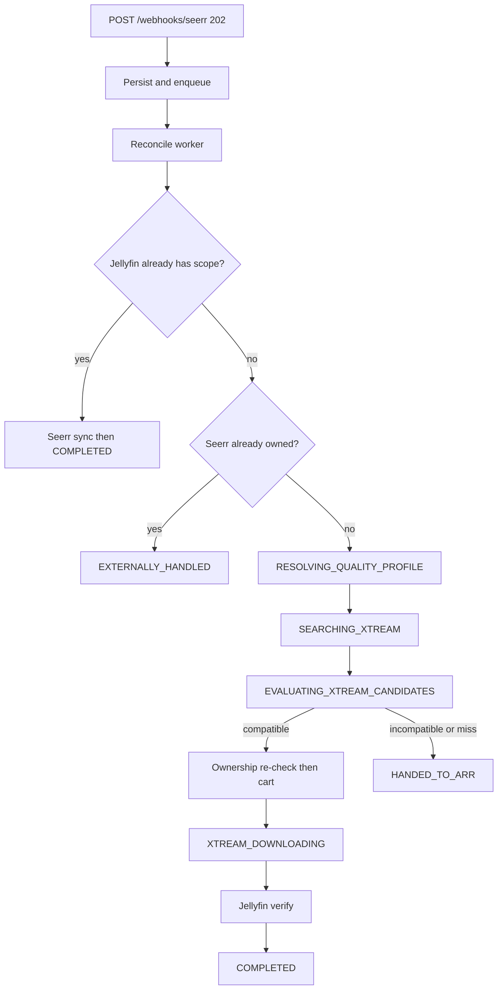

# Implementation Plan

Architecture for `seerr-xtream-bridge`. See also [upstream-api-analysis.md](./upstream-api-analysis.md).

## Goals

- Intercept Seerr `MEDIA_PENDING` webhooks (HTTP 202, async work).
- Prefer XtreamFilter acquisition when identity, season scope, and quality-profile constraints match.
- Use Jellyfin as the sole authority that media exists before completing Seerr.
- Fall back by approving the **original** Seerr request → Radarr/Sonarr (`HANDED_TO_ARR`).
- Never rewrite quality profiles; never invent availability or release metadata.

## Stack

- Node.js current LTS, TypeScript, Fastify, Zod, Vitest
- SQLite + Drizzle (`better-sqlite3`), WAL / foreign_keys / busy_timeout
- Clients: Seerr, XtreamFilter, Jellyfin, Radarr, Sonarr
- Metrics: `prom-client`; logs: pino JSON

## High-level flow



## State machine

```
RECEIVED → VALIDATING → CHECKING_JELLYFIN
  → short-circuit → WAITING_FOR_JELLYFIN → AVAILABLE → COMPLETING_SEERR → COMPLETED
  → CHECKING_SEERR_OWNERSHIP → EXTERNALLY_HANDLED
  → RESOLVING_QUALITY_PROFILE
  → SEARCHING_XTREAM
  → EVALUATING_XTREAM_CANDIDATES
  → XTREAM_MATCHED | XTREAM_NOT_FOUND | XTREAM_AMBIGUOUS
Xtream: XTREAM_QUEUING → XTREAM_QUEUED → XTREAM_DOWNLOADING
  → WAITING_FOR_JELLYFIN → AVAILABLE → COMPLETING_SEERR → COMPLETED
Fallback: FALLBACK_PENDING → FALLBACK_APPROVING → HANDED_TO_ARR
Failures: FAILED_RETRYABLE | FAILED_PERMANENT
```

Every transition persists job state + `events` row in one SQLite transaction.

## Quality resolution

1. Load Seerr request → `serverId`, `profileId`, `is4k`.
2. Resolve *arr connection from Seerr settings (or env overrides).
3. `GET /api/v3/qualityprofile/{id}` → normalize `ResolvedQualityProfile` + `ObservableQualityConstraints`.
4. Cache in-memory for `QUALITY_PROFILE_CACHE_TTL_SECONDS` (default 300).
5. Transient *arr failures → `FAILED_RETRYABLE`.

Recyclarr is not a runtime dependency. Profiles are always read from Radarr/Sonarr.

## Candidate selection order

1. Media identity confidence (TMDb exact beats title)
2. Requested TV season completeness (`all_or_nothing`)
3. Quality-profile hard constraints
4. Quality preference score
5. Deterministic tie-breaker (source_id, stream_id)

`QUALITY_UNKNOWN_POLICY=allow|strict` controls unknowns (source/codec/HDR).

## Idempotency

`operations.operation_key` UNIQUE, e.g.:

- `queue:seerr:{id}:movie:{tmdb}`
- `queue:seerr:{id}:tv:{tmdb}:season:{n}`
- `fallback:seerr:{id}`
- `mark-available:seerr:{id}`
- `approve:seerr:{id}`

409 from cart: verify `(source_id, stream_id)` or season tuple via `GET /api/cart` before success.

Pre-queue: re-fetch Seerr ownership; if not PENDING → `EXTERNALLY_HANDLED`.

## Seerr completion (Xtream path)

1. Cart complete
2. Jellyfin refresh + verify TMDb / seasons / episodes
3. Wait `SEERR_AVAILABILITY_GRACE_SECONDS`
4. Mark available only if Seerr still stale
5. Wait for auto PENDING→APPROVED→COMPLETED
6. If still PENDING after `SEERR_REQUEST_COMPLETION_GRACE_SECONDS` and media AVAILABLE → approve once

## Fallback

Approve original request once → `HANDED_TO_ARR`. Do not monitor *arr further. Never change profile/server/tags.

## Provider activity

```ts
interface ProviderActivityService {
  canAcquire(source: XtreamSource): Promise<boolean>;
}
```

v1 always returns `true`. Document Dispatcharr connection contention.

## HTTP API

| Method | Path                                    | Auth           |
| ------ | --------------------------------------- | -------------- |
| GET    | `/health`                               | public         |
| GET    | `/ready`                                | public         |
| POST   | `/webhooks/seerr`                       | webhook secret |
| GET    | `/api/jobs`, `/api/jobs/:id`            | BRIDGE_API_KEY |
| POST   | `/api/jobs/:id/retry`, `/api/reconcile` | BRIDGE_API_KEY |
| GET    | `/metrics`                              | optional       |

## Persistence

Tables: `requests`, `request_scopes`, `acquisition_jobs` (incl. quality snapshot JSON), `xtream_items`, `events`, `operations`.

## Testing

Unit: matching, quality parser/evaluator, state transitions, retry classification, partial TV.  
Integration: fixtures for Seerr/Radarr/Sonarr/XtreamFilter/Jellyfin; scenarios from the product plan.
